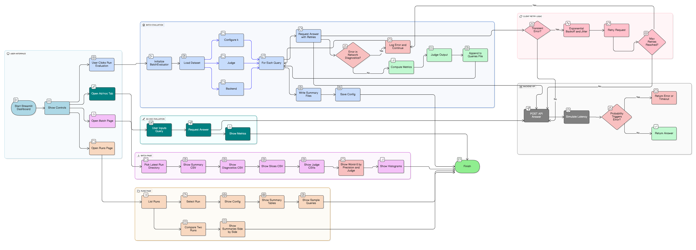

# RAG Evaluation Dashboard

Evaluate retrieval and QA backends through a Streamlit dashboard and a batch evaluator. This repo does not build a RAG pipeline; it measures one. You point it at a backend, run a dataset, and get structured metrics, diagnostics, and judge summaries.

---

## Why this repo

- Treats your backend as a black box and enforces a consistent response schema.
- Produces reproducible, comparable run artifacts (overall, per-slice, judge, diagnostics).
- Includes a resilient client for realistic failure/latency modeling and observability.
- Makes it easy to diff runs (overall and per-slice) to track improvements and regressions.

---

## Features

- Streamlit UI:
  - Batch Evaluation: run datasets, view metrics, diagnostics, histograms, and worst-5 cases.
  - Runs: browse artifacts, download CSV/JSONL, and compare two runs with delta tables.
- FastAPI proxy: /health and /api/answer with normalization of top_chunks and answer payload.
- Resilient HTTP client: retries with exponential backoff + jitter, error bucketing, latency guard.
- Metrics: precision@k, recall@k, hit@k, ndcg@k, mean reciprocal rank (MRR).
- Judges: heuristic or LLM-driven scoring for helpfulness, correctness, grounding.
- Artifacts per run: queries.jsonl, summary.csv, summary_slices.csv, summary_diagnostics.csv, summary_judge.csv, summary_slices_judge.csv, config.json.

---

## Repository layout

- api/proxy_api.py — FastAPI proxy that normalizes upstream responses.
- client/resilient_client.py — retried HTTP calls, backoff, error buckets, net diagnostics.
- client/mock_client.py — simple client without retries.
- dashboard/pages/1_Batch_Eval.py — run evals, visualize, worst-5, histograms, judge summaries.
- dashboard/pages/2_Runs.py — browse runs, download artifacts, A/B diffs (overall, judge, per-slice).
- evaluation/batch_eval.py — evaluation loop, metrics, judge, aggregation, and writers.
- evaluation/metrics.py — precision@k, recall@k, hit@k, ndcg@k, MRR helpers.
- evaluation/judges.py — HeuristicJudge and LLMJudge adapters.

---

## Dataflow diagram

---

## Getting started

### Requirements
- Python 3.9+
- FastAPI, Uvicorn, Streamlit, requests/httpx, and standard scientific/utility packages.

### Install
- Create a virtual env and install dependencies as listed in the project (requirements.txt / pyproject.toml).

### Start the proxy API
- Set REAL_BACKEND_URL to your actual system’s base URL.
- Run:
  ~~~bash
  uvicorn rag_eval.api.proxy_api:app --host 0.0.0.0 --port 8001
  ~~~

### Launch the dashboard
- Batch page:
  ~~~bash
  streamlit run rag_eval/dashboard/pages/1_Batch_Eval.py
  ~~~
- Runs page:
  ~~~bash
  streamlit run rag_eval/dashboard/pages/2_Runs.py
  ~~~

---

## Backend protocol

- GET /health — health check.
- POST /api/answer with body:
  ~~~json
  {"query": "string", "k": 5}
  ~~~
- Proxy returns a normalized payload:
  ~~~json
  {
    "answer": "string",
    "subqueries": ["..."],
    "top_chunks": [
      {"id": "doc-1", "chunk": "text", "score": 0.42, "source": "optional"}
    ]
  }
  ~~~
- The proxy tolerates upstream variations (e.g., chunks/chunk/text/content fields) and maps them to a stable shape.

---

## Dataset format (JSONL)

Each line is a record:
- id: string (optional; auto-generated if missing)
- query: string (required)
- relevant_chunks: list[string] of relevant chunk ids (optional but needed for retrieval metrics)
- slice: string or list[string] for per-slice aggregation (optional)
- metadata: arbitrary object (optional)
- gold_answer: string for judge reference (optional)

Example:
~~~json
{"id":"q-001","query":"What is the refund policy?","relevant_chunks":["doc-12","doc-34"],"slice":["policy","faq"],"metadata":{"source":"kb"},"gold_answer":"Refunds are processed within 5 business days."}
~~~

---

## Metrics

- Precision@k: \( \mathrm{P@k} = \frac{\text{relevant hits in top }k}{k} \)
- Recall@k: \( \mathrm{R@k} = \frac{\text{relevant hits in top }k}{|\text{relevant}|} \)
- Hit@k: \( \mathrm{Hit@k} = 1 \) if any relevant is in top \(k\), else \(0\)
- NDCG@k: \( \mathrm{NDCG@k} = \frac{\mathrm{DCG@k}}{\mathrm{IDCG@k}} \) (binary gains)
- MRR: \( \mathrm{MRR} = \frac{1}{\text{rank of first relevant}} \) (or \(0\) if none)

---

## Judges

- HeuristicJudge: lightweight scoring with overlap/length/context grounding heuristics.
- LLMJudge: calls your inference function and parses scores robustly (0..1).

Plug in an LLM function:
~~~python
from evaluation.batch_eval import evaluate_dataset

def call_llm(prompt: str, seed=None) -> str:
    # Return JSON: {"helpfulness":0..1,"correctness":0..1,"grounding":0..1,"notes":"..."}
    return '{"helpfulness":0.7,"correctness":0.6,"grounding":0.65,"notes":"ok"}'

evaluate_dataset(
    dataset_path="data/sample.jsonl",
    k=3,
    outdir="runs",
    backend_url="http://localhost:8001",
    judgetype="llm",
    llm_inference_fn=call_llm,
)
~~~

---

## Running a batch (via UI)

- Open the Batch Evaluation page.
- Select dataset, set k, choose judge ("heuristic" or "llm"), set Backend URL (default http://localhost:8001).
- Click “Run evaluation”. A new run_<timestamp> directory appears under runs.

---

## Outputs (per run directory)

- queries.jsonl — per-query records with response, metrics, diagnostics, judge outputs, slices, network info.
- summary.csv — overall metrics (means of precision@k, recall@k, hit@k, ndcg@k, MRR).
- summary_slices.csv — per-slice counts and means for the same retrieval metrics.
- summary_diagnostics.csv — latency percentiles (p50/p95/p99), error_rate, error buckets, retries stats, retrieval score summaries.
- summary_judge.csv — overall averages of helpfulness/correctness/grounding.
- summary_slices_judge.csv — per-slice averages for judge scores.
- config.json — run config, seed, code version tag, observed_failure_rate, aborted_early flag, etc.

---

## Runs page and diffs

- Browse run artifacts and download CSV/JSONL.
- Compare two runs:
  - Overall metrics diff (precision@, recall@, hit@, ndcg@, mean_mrr).
  - Judge metrics diff (correctness, grounding, helpfulness).
  - Per-slice diffs for both retrieval and judge metrics.

---

## Configuration (env vars)

- REAL_BACKEND_URL — proxy upstream base URL.
- EVAL_BACKEND_URL — default backend URL for the client/UI (e.g., http://localhost:8001).
- CLIENT_DEFAULT_TIMEOUT — per-request timeout (seconds).
- CLIENT_MAX_RETRIES — number of retries.
- CLIENT_BACKOFF_BASE — base backoff (seconds).
- CLIENT_BACKOFF_JITTER — added jitter (seconds).
- CLIENT_LONG_TAIL_GUARD_MS — cap on reported latency.
- EVAL_RUNS_DIR — directory for runs (default: runs).
- EVAL_ABORT_FAILURE_RATE — optional early abort threshold (0..1) after a minimum number of attempts.
- EVAL_LATENCY_P95_BUDGET_MS / EVAL_LATENCY_P99_BUDGET_MS — surface budget warnings in UI.

---

## Troubleshooting

- “Run directory not found” in UI: confirm the path and that the run finished writing artifacts.
- Empty metrics: check that relevant_chunks exist in the dataset and that backend returns top_chunks with consistent ids.
- High error_rate: verify backend availability; adjust CLIENT_MAX_RETRIES/BACKOFF/timeout; inspect error buckets in diagnostics.

---

## Roadmap

- Optional schema validation for datasets with richer reporting.
- Export to parquet for large-scale analysis.
- More judge adapters (e.g., prompt templating, structured outputs).
- CLI wrappers for batch runs and diffs.

---

## License

Add your preferred license (MIT/Apache-2.0) at the repository root.
